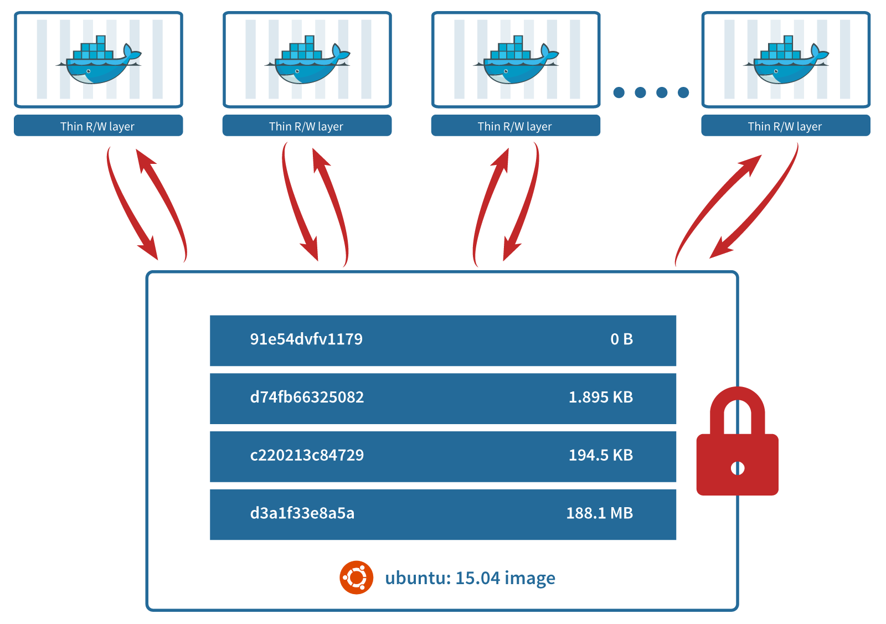
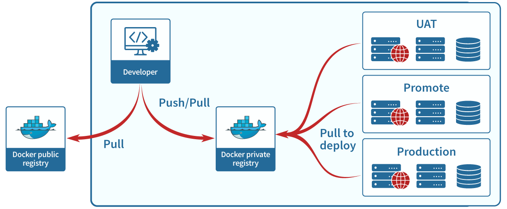
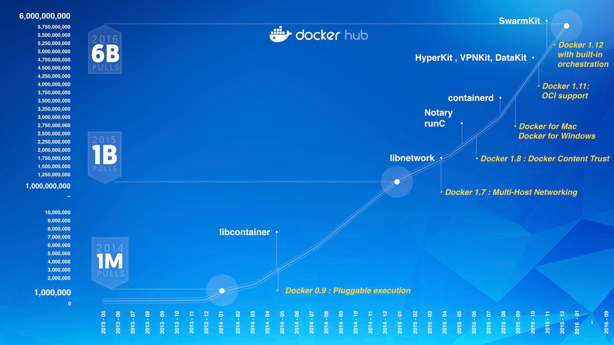
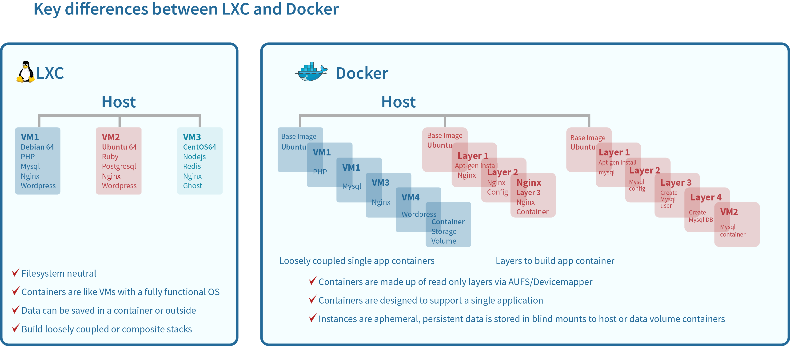

# Container Deep Dive

Source: https://robinsystems.com/blog/containers-deep-dive-lxc-vs-docker-comparison/

Compare about:

1. Popularity
2. Architecture
3. Storage Management
4. Client Tools and Onboarding
5. Image Registry
6. Application Support
7. Vendor Support & Ecosystem

## 2. Architecture

Docker is more than an image format and a daemon, though. The complete Docker architecture comprises the following components:

- Docker daemon: runs on a host
- Client: connects to the daemon, and is the primary user interface
- Images: read-only template used to create containers
- Containers: runnable instance of a Docker image
- Registry: private or public registry of Docker images
- Services: a scheduling service called Swarm which enables multi-host, multi-container deployment. Swarm was introduced in version 1.12

## 3. Storage Management Docker vs LXC

## 4. Client Tools and Onboarding

The 3 key Docker client tools are:

1. `Dockerfile` – A text file that contains all the commands a user could call on the command line to assemble an image.
2. `Docker CLI` – This is the primary interface for using all Docker features.
3. `Docker Compose` – A tool for defining and running multi-container Docker applications using a simple YAML file.

## 5. Image Registry

One of the key components of the Docker architecture:
- `Image Registry`: that stores and lets you distribute Docker images. Docker provides both a private image registry and a publicly hosted version of this registry called Docker Hub which is accessible to all Docker users.

## 6. Application Support

Microservices architecture has gained popularity amongst new web-scale companies like Netflix, Google, Twitter, etc. Applications with a microservice architecture consist of a set of narrowly focused, independently deployable services, which are expected to fail.

- **Advantage**: increased agility and resilience. Agility since individual services can be updated and redeployed in isolation. Given the distributed nature of microservices, they can be deployed across different platforms and infrastructures, and the developers are forced to think about resilience from the ground up instead of as an afterthought.

Microservices architecture and containers, together, make applications that are faster to build and easier to maintain while having overall higher quality. This makes Docker a perfect fit. Docker has designed its container solution around the microservices philosophy and recommends that each container deal with a single concern. So applications now can span 100s or 1000s of containers.

- Bottomline, if you are writing new applications, whether they are microservices-based or 3-tier architecture based, **Docker is the best platform to pursue.**
- But if you want to gain all benefits of containers, without significantly changing operational processes, then **LXC will be a better fit.**

## 7. Vendor Support & Ecosystem

