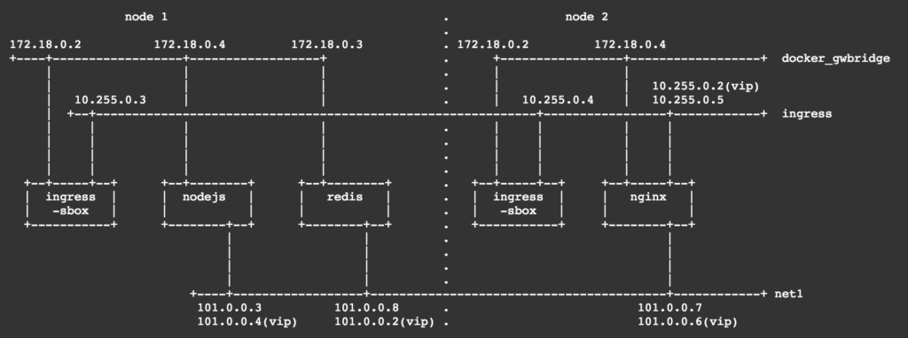

<!-- TOC -->

- [Docker Swarm](#docker-swarm)
    - [Docker Swarm Tutorial](#docker-swarm-tutorial)
        - [On manager node](#on-manager-node)
        - [On worker node](#on-worker-node)
    - [Docker Swarm Firewall](#docker-swarm-firewall)
    - [Docker Swarm Management](#docker-swarm-management)
        - [Get node info](#get-node-info)
    - [Docker service](#docker-service)
        - [Persist Portainer Data](#persist-portainer-data)
    - [Benchmark](#benchmark)
- [Secret](#secret)
- [Overlay Network](#overlay-network)
- [Tìm hiểu cơ chế network của Docker Swarm](#tìm-hiểu-cơ-chế-network-của-docker-swarm)

<!-- /TOC -->

# Docker Swarm
## Docker Swarm Tutorial

https://github.com/docker/labs/blob/master/swarm-mode/beginner-tutorial/README.md


Open Firewall: Allow all connection from LAN Private Network.

```
n01	188.166.186.249	10.130.20.211
n02	188.166.214.96	10.130.54.91
n03	139.59.98.131	10.130.54.105
```


```bash
vi /etc/hosts
```

```
188.166.186.249	n01
188.166.214.96	n02
139.59.98.131	n03
```


In order to use overlay networks in the swarm, you need to have the following ports open between the swarm nodes before you enable swarm mode:

```
Port 7946 TCP/UDP for container network discovery.
Port 4789 UDP for the container overlay network.
```

### On manager node

```bash
docker swarm init --advertise-addr 10.130.20.211
```

### On worker node

```bash
#docker swarm join 10.130.20.211:2377

docker swarm join \
    --token SWMTKN-1-5jzta0vyfjjcuyf58nfl2z2q7lii8epmcr4v6ua7rwsxlqiecq-3br60how0y6er9p6u47ft45ja \
    10.130.20.211:2377

```

```bash
docker service create --name collab alpine:3.4 ping google.com
docker service ps collab
docker service scale collab=5

docker service update --image alpine:3.3 collab

docker service
```


## Docker Swarm Firewall

nc -w 1 10.130.20.211 2377 < /dev/null; echo $?


## Docker Swarm Management

```
Usage:  docker node COMMAND

Manage Swarm nodes

Options:
      --help   Print usage

Commands:
  demote      Demote one or more nodes from manager in the swarm
  inspect     Display detailed information on one or more nodes
  ls          List nodes in the swarm
  promote     Promote one or more nodes to manager in the swarm
  ps          List tasks running on one or more nodes, defaults to current node
  rm          Remove one or more nodes from the swarm
  update      Update a node
```


### Get node info

```bash
docker node inspect self --pretty
```


## Docker service

```bash
docker service update --image


--mode string
    Service mode (replicated or global) (default "replicated")

```


http://portainer.io/install.html

```bash
docker run -d -p 9000:9000 \
    -v "/var/run/docker.sock:/var/run/docker.sock" \
    portainer/portainer


docker service create \
    --name portainer \
    -p 9000:9000 \
    --constraint 'node.role == manager' \
    --mount type=bind,src=/var/run/docker.sock,dst=/var/run/docker.sock \
    portainer/portainer \
    -H unix:///var/run/docker.sock


sudo mkdir -p /srv/docker/portainer_data

docker service create \
    --name portainer \
    --publish 9000:9000 \
    --constraint 'node.role == manager' \
    --mount type=bind,src=/srv/docker/portainer_data,dst=/data \
     --mount type=bind,src=/var/run/docker.sock,dst=/var/run/docker.sock \
    portainer/portainer \
    -H unix:///var/run/docker.sock
```

```bash
docker service update --image portainer/portainer:linux-amd64 portainer

```

Pass: qwer4321


### Persist Portainer Data
docker run -d -p 9000:9000 -v /path/on/host/data:/data portainer/portainer


```
docker service create \
    --name my_web \
    --replicas 3 \
    --publish 8080:80 \
    nginx:alpine
```


```bash
# Constraint by hostname
docker service create \
    --name tnginx \
    --publish 81:80 \
    --constraint 'node.hostname == n01' \
    tranhuucuong91/nginx:alpine-test


# Scale service
docker service scale tnginx=2

# Test load balacing
for i in `seq 10`; do
    curl http://188.166.186.249:81/hostname.html
done
```


## Benchmark

```bash
docker run -it \
    --name testbox \
    ubuntu:16.04 bash

docker run -it \
    --name testbox \
    bitnami/minideb bash


apt-get update
apt-get install -y apache2-utils

ab -n 1000000 -c 1000 http://188.166.186.249:81/hostname.html

```


# Secret


docker secret create password.txt ./password.txt

docker service create \
    --name tnginx-secret \
    --publish 82:80 \
    --secret password.txt \
    nginx:alpine


# Overlay Network

docker network create --opt encrypted --subnet 100.0.0.0/24 -d overlay net1

docker service create --name redis --network net1 redis
docker service create --name node --network net1 nvbeta/node
docker service create --name nginx --network net1 -p 1080:80 nvbeta/swarm_nginx


ip netns


docker service create \
    --name tnginx \
    --publish 80:80 \
    --network test_overlay \
    tranhuucuong91/nginx:alpine-test


docker service create \
    --name my-alpine \
    --network test_overlay \
    alpine \
    sleep 3000


for i in `seq 10`; do
  curl -s http://tnginx/hostname.html
done


for i in `seq 10`; do
  curl -s http://188.166.186.249/hostname.html
done


# Tìm hiểu cơ chế network của Docker Swarm

http://neuvector.com/blog/docker-swarm-container-networking/





```bash
docker network ls
docker ps

# Link netns from docker to host
cd /var/run
sudo ln -s /var/run/docker/netns netns
sudo ip netns

docker exec node.1.10yscmxtoymkvs3bdd4z678w4 ip link

sudo ip netns exec 2-8vty8k3pej ip link

sudo ip netns exec 72df0265d4af ip addr

ip link

brctl show

docker network inspect ingress
docker network inspect docker_gwbridge


# Check iptables
sudo iptables -t nat -nvL
sudo ip netns exec 72df0265d4af iptables -nvL -t nat

# ipvs
sudo ip netns exec 72df0265d4af iptables -nvL -t mangle
sudo ip netns exec 72df0265d4af ipvsadm -ln

```


**Confirm VIP connectivity**

In general we recommend you use `dig`, `nslookup`, or another DNS query tool to test access to the service name via DNS. Because a VIP is a logical IP, `ping` is not the right tool to confirm VIP connectivity.


